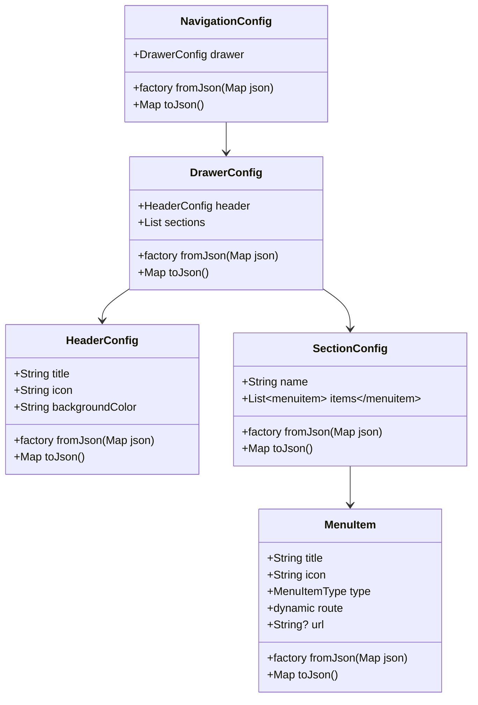

# Navigation Implementation Plan

## Overview
This document outlines the plan for implementing a configurable navigation drawer system using JSON configuration files, including comprehensive error handling strategies.

## 1. Configuration Structure

```json
{
  "drawer": {
    "header": {
      "title": "Navigation Menu",
      "icon": "person",
      "backgroundColor": "#1E2530"
    },
    "sections": [
      {
        "name": "Main Navigation",
        "items": [
          {
            "title": "Home",
            "icon": "home",
            "type": "internal",
            "route": 0
          }
        ]
      },
      {
        "name": "External Links",
        "items": [
          {
            "title": "Old Skool Sessions",
            "icon": "music_note",
            "type": "external",
            "url": "https://oldskoolsessions.com"
          }
        ]
      }
    ]
  }
}
```

## 2. Class Architecture



## 3. Error Handling Strategy

### 3.1 Error Types

```dart
enum ConfigErrorType {
  fileNotFound,
  invalidJson,
  validationError,
  missingRequired,
  invalidValue,
  unknown
}

class ConfigError {
  final ConfigErrorType type;
  final String message;
  final String? field;
  final dynamic details;
  final StackTrace? stackTrace;
}
```

### 3.2 Validation Rules

1. **Header Validation**:
   - Title: Required, max 50 characters
   - Icon: Required, valid Material icon name
   - Background Color: Required, valid hex color code

2. **Menu Item Validation**:
   - Title: Required, max 50 characters
   - Icon: Required, valid Material icon name
   - Type: Must be "internal" or "external"
   - Route: Required for internal type, must be non-negative integer
   - URL: Required for external type, must be valid URL

### 3.3 Error Recovery

1. **Fallback Mechanism**:
   ```dart
   class NavigationFallback {
     static NavigationConfig getDefaultConfig() {
       // Default minimal configuration
     }
   }
   ```

2. **Recovery Steps**:
   - Attempt to load primary configuration
   - Try backup configuration if primary fails
   - Fall back to default configuration
   - Log errors and notify user

## 4. Implementation Steps

### 4.1 Project Setup

1. Update `pubspec.yaml`:
```yaml
dependencies:
  json_annotation: ^4.8.1

dev_dependencies:
  json_serializable: ^6.7.0
  build_runner: ^2.4.6
```

2. Add assets:
```yaml
flutter:
  assets:
    - assets/config/navigation_config.json
```

### 4.2 File Structure

```
lib/
  ├── config/
  │   └── navigation_config.dart
  ├── models/
  │   └── navigation/
  │       ├── drawer_config.dart
  │       ├── header_config.dart
  │       ├── section_config.dart
  │       └── menu_item.dart
  ├── services/
  │   └── config_service.dart
  └── utils/
      └── navigation_provider.dart

assets/
  └── config/
      └── navigation_config.json
```

### 4.3 Implementation Order

1. Create models with JSON serialization
2. Implement configuration service with error handling
3. Update navigation provider
4. Modify custom drawer widget
5. Add error recovery system
6. Implement logging and monitoring
7. Add user feedback mechanisms

## 5. Error Logging and Monitoring

### 5.1 Logging Strategy

- Configuration loading attempts
- Validation failures
- Configuration changes
- User-facing errors
- Performance metrics

### 5.2 Debug Information

- File locations
- Validation details
- Stack traces (debug mode)
- Loading performance data

## 6. Usage Guidelines

### 6.1 Modifying Navigation

1. Edit `assets/config/navigation_config.json`
2. Follow the JSON structure
3. Validate using provided schema
4. Test changes in debug mode

### 6.2 Error Messages

Users will see appropriate messages for:
- Missing configuration
- Invalid configuration
- Loading failures
- Navigation errors

## 7. Next Steps

1. Implement models and JSON serialization
2. Set up configuration service
3. Add error handling and recovery
4. Update UI components
5. Add documentation and examples