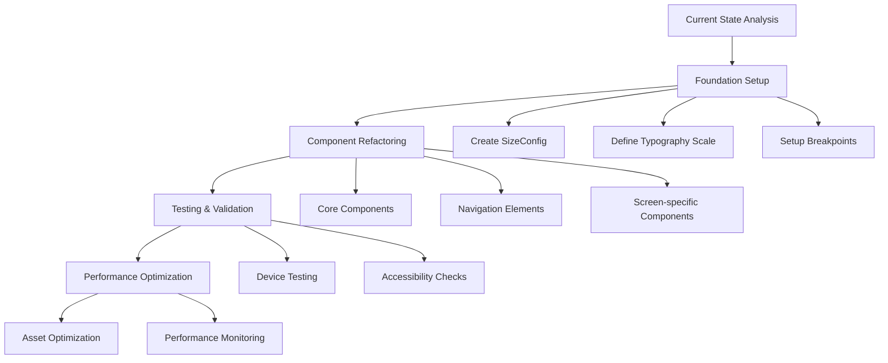

# Flutter Application Scaling Implementation Plan

## Overview
This document outlines the comprehensive plan for implementing responsive scaling across the application to ensure consistent behavior across different device sizes and orientations.



## 1. Foundation Setup

### 1.1 Size Configuration System

Create a centralized size configuration system to manage responsive scaling:

```dart
class SizeConfig {
  static late MediaQueryData _mediaQueryData;
  static late double screenWidth;
  static late double screenHeight;
  static late double blockSizeHorizontal;
  static late double blockSizeVertical;
  
  // Base sizes for different device categories
  static const double mobileBaseWidth = 375;
  static const double tabletBaseWidth = 768;
  static const double desktopBaseWidth = 1440;
  
  // Default spacing units
  static late double spacing;  // Base unit (8.0)
  static late double spacingSmall;  // 4.0
  static late double spacingLarge;  // 16.0
  
  static void init(BuildContext context) {
    _mediaQueryData = MediaQuery.of(context);
    screenWidth = _mediaQueryData.size.width;
    screenHeight = _mediaQueryData.size.height;
    blockSizeHorizontal = screenWidth / 100;
    blockSizeVertical = screenHeight / 100;
    
    // Initialize spacing based on screen size
    spacing = blockSizeHorizontal * 2;  // 2% of screen width
    spacingSmall = spacing / 2;
    spacingLarge = spacing * 2;
  }
}
```

### 1.2 Typography Scale

Implement a consistent typography system:

```dart
class AppTypography {
  static TextTheme get textTheme {
    return const TextTheme(
      displayLarge: TextStyle(fontSize: 57, height: 1.12),
      displayMedium: TextStyle(fontSize: 45, height: 1.15),
      displaySmall: TextStyle(fontSize: 36, height: 1.22),
      headlineLarge: TextStyle(fontSize: 32, height: 1.25),
      headlineMedium: TextStyle(fontSize: 28, height: 1.29),
      headlineSmall: TextStyle(fontSize: 24, height: 1.33),
      titleLarge: TextStyle(fontSize: 22, height: 1.27),
      titleMedium: TextStyle(fontSize: 16, height: 1.5),
      titleSmall: TextStyle(fontSize: 14, height: 1.43),
      bodyLarge: TextStyle(fontSize: 16, height: 1.5),
      bodyMedium: TextStyle(fontSize: 14, height: 1.43),
      bodySmall: TextStyle(fontSize: 12, height: 1.33),
    ).apply(
      fontFamily: 'Roboto',
      displayColor: Colors.black,
      bodyColor: Colors.black87,
    );
  }
}
```

### 1.3 Responsive Breakpoints

Define consistent breakpoints for device categories:

```dart
enum DeviceType { mobile, tablet, desktop }

class Breakpoints {
  static const double mobile = 600;
  static const double tablet = 1024;
  
  static DeviceType getDeviceType(BuildContext context) {
    final width = MediaQuery.of(context).size.width;
    if (width >= tablet) return DeviceType.desktop;
    if (width >= mobile) return DeviceType.tablet;
    return DeviceType.mobile;
  }
}
```

## 2. Component Refactoring Strategy

### 2.1 Core Components

1. Create responsive mixins for consistent scaling:

```dart
extension ResponsiveSize on num {
  double get w => SizeConfig.blockSizeHorizontal * this;
  double get h => SizeConfig.blockSizeVertical * this;
}
```

2. Example of updating CustomDrawer with responsive sizes:

```dart
CircleAvatar(
  radius: 5.w,  // Using responsive width
  child: Icon(
    _getIconData(config.drawer.header.icon),
    size: 5.w,
  ),
)
```

### 2.2 Navigation Elements

Define adaptive navigation properties based on device type:

```dart
class AdaptiveNavigationConfig {
  static double get drawerWidth => 
    switch(Breakpoints.getDeviceType(context)) {
      DeviceType.mobile => 85.w,
      DeviceType.tablet => 40.w,
      DeviceType.desktop => 25.w,
    };
}
```

### 2.3 Screen Layout Patterns

Implement a responsive builder for conditional layouts:

```dart
class ResponsiveBuilder extends StatelessWidget {
  final Widget mobile;
  final Widget? tablet;
  final Widget? desktop;

  Widget build(BuildContext context) {
    return LayoutBuilder(builder: (context, constraints) {
      final deviceType = Breakpoints.getDeviceType(context);
      switch (deviceType) {
        case DeviceType.desktop:
          return desktop ?? tablet ?? mobile;
        case DeviceType.tablet:
          return tablet ?? mobile;
        case DeviceType.mobile:
          return mobile;
      }
    });
  }
}
```

## 3. Testing Requirements

### 3.1 Device Testing Matrix

| Device Category | Screen Sizes | Orientation |
|----------------|--------------|-------------|
| Mobile         | 320x568     | Portrait    |
|                | 375x667     | Portrait    |
|                | 414x896     | Both        |
| Tablet         | 768x1024    | Both        |
|                | 834x1194    | Both        |
| Desktop        | 1024x768    | Landscape   |
|                | 1440x900    | Landscape   |

### 3.2 Accessibility Requirements

- Minimum touch target size: 44x44 logical pixels
- Text scaling support up to 200%
- High contrast mode support
- Screen reader compatibility
- WCAG 2.1 compliance for text contrast ratios

## 4. Performance Optimization

### 4.1 Asset Optimization

1. Implement resolution-aware images:
```yaml
assets:
  - assets/images/1.0x/
  - assets/images/2.0x/
  - assets/images/3.0x/
```

2. Image caching strategy:
- Implement memory cache for frequently used images
- Use appropriate image formats (WebP for web)
- Implement lazy loading for images below the fold

### 4.2 Performance Monitoring

Key metrics to track:
1. Frame render time
   - Target: < 16ms per frame (60 FPS)
   - Monitor jank frames
   - Track heavy layout operations

2. Memory usage
   - Track across different screen sizes
   - Monitor image memory consumption
   - Watch for memory leaks during orientation changes

3. Layout Performance
   - Implement const constructors where possible
   - Use RepaintBoundary for complex animations
   - Implement lazy loading for lists and grids
   - Monitor rebuild frequency

## 5. Implementation Timeline

### Phase 1: Foundation (Week 1)
- Set up SizeConfig
- Implement typography scale
- Configure breakpoints
- Create responsive utilities

### Phase 2: Component Refactoring (Weeks 2-3)
- Update core components
- Refactor navigation elements
- Implement responsive layouts
- Create reusable patterns

### Phase 3: Testing (Week 4)
- Device testing
- Accessibility validation
- Performance testing
- Bug fixes and optimizations

### Phase 4: Documentation & Review (Week 5)
- Document responsive patterns
- Create usage guidelines
- Performance optimization guide
- Final review and adjustments

## 6. Success Metrics

1. Visual Consistency
   - UI elements maintain proportions across devices
   - Text remains readable at all sizes
   - Spacing remains consistent relative to screen size

2. Performance
   - 60 FPS maintained during transitions
   - No layout overflow issues
   - Memory usage within acceptable limits

3. Accessibility
   - WCAG 2.1 AA compliance
   - Support for system font scaling
   - Proper screen reader support